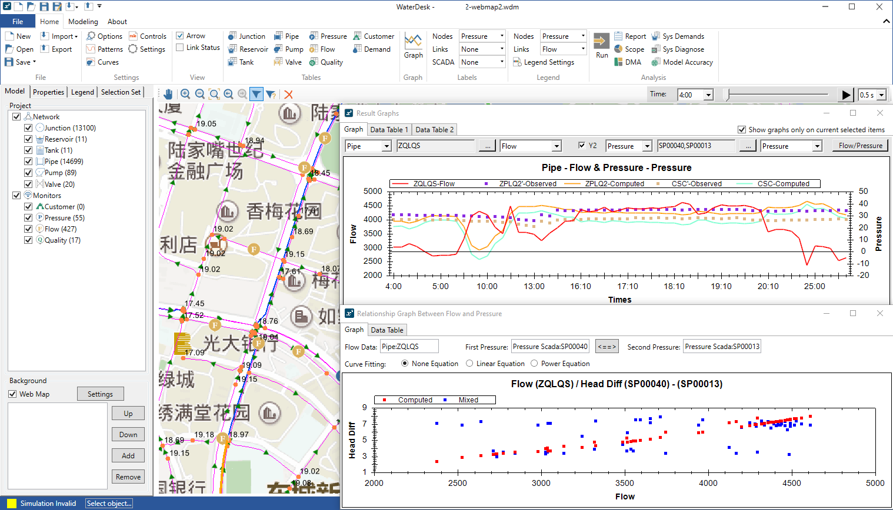

# WaterDesk
WaterDesk 慧水供水模型软件

近几年，随着智慧水务建设节奏逐步加快，供水管网模型成为行业聚焦热点，利用模型对管网运行数据进行挖掘也变为现实。如何降低建模的门槛，使模型成为供水企业重要的技术工具，从而加快企业实现智慧水务的步伐是我们一直追求的目标。为此，我们于2019年开发了一款功能完整的供水模型软件---WaterDesk，致力于帮助企业能够快速且高效建立供水管网模型。

WaterDesk软件功能完善、操作便捷、界面美观，适用于不同信息化阶段的供水企业对各种复杂工况环境的模拟需求。软件支持主流的数据格式，如INP，SHP，DXF和Excel等；具有专业的运营分析功能，如水厂停运缺水分析、管网分区设计、供水范围审查和管网运行诊断等；并通过便捷的图例、标注功能以及丰富的表格、曲线展示提高了软件的易用性。

诚挚欢迎各位同仁光临公司网站[http://www.info-water.com](http://www.info-water.com)免费下载使用，也热忱地希望大家给我们的软件提出建议，让我们共同为智慧水务建设尽微薄之力。

上海慧水科技有限公司

## Release Notes

### version 1.5.0
 * Demand allocation by referencing to Customers
 * Fix epanet bugs: some Pump Curve's bugs during simulation calculation
 * Add PCI (Pressure Calibration Index) analysis
 * Add more SCADA objects: Frequency (for Pump), Energy (for Pump), Switch (for Pump or Valve), and Level (for Reservoir or Tank)
 * Support Baidu Earth for web map
 * Some bug fixes

### version 1.4.0
 * Add recent file list
 * Fix epanet bug: apply pressure control during ggasolver
 * Pump curve fitting
 * Some bug fixes

### version 1.3.0
 * Add Baidu Map
 * Fix epanet bug: reset speed to 0.0 if change pump status to LINK_CLOSED
 * Some bug fixes and performance improvement